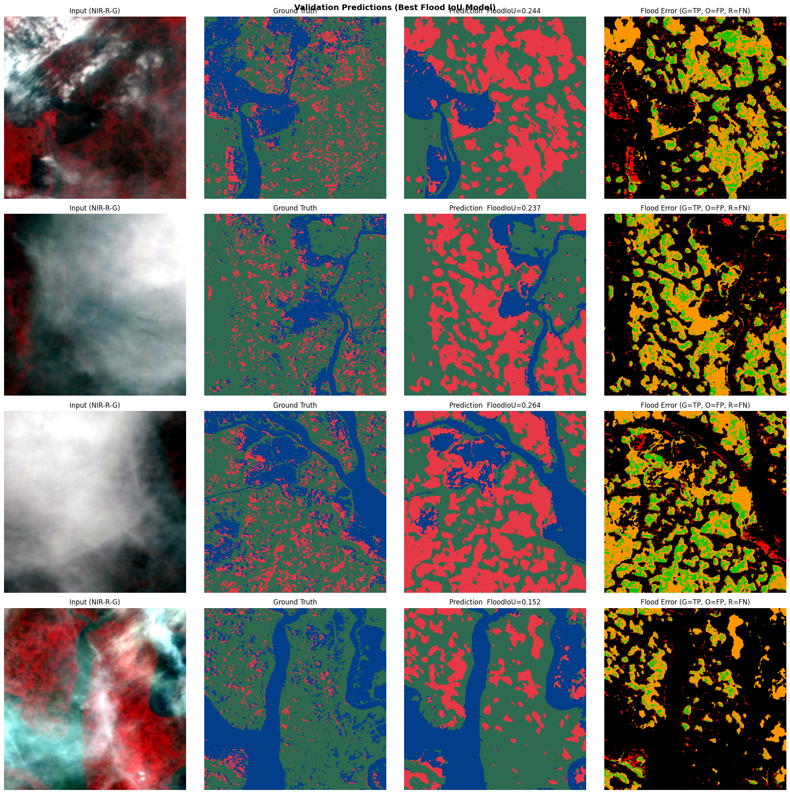
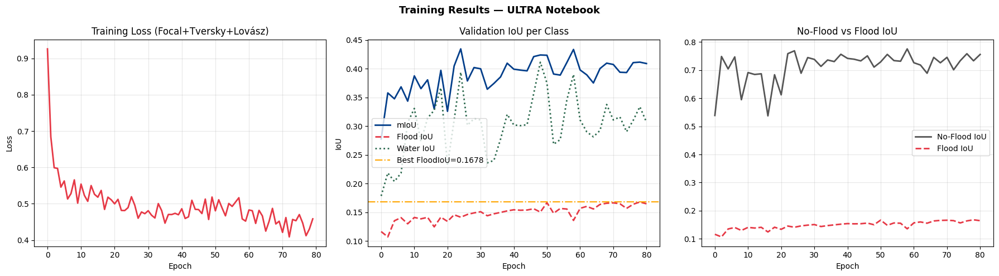

# 🌊 Flood Detection & Segmentation — AISEHack 2026 | Phase 2 | Theme 1 | IBM

<p align="center">
  
</p>

<p align="center">
  <a href="https://huggingface.co/Tanisha0311/flood-segmentation-segformer-b5">
    
  </a>
  
  
  
</p>

---

## 📌 Overview

This project presents a **deep learning-based multi-class flood segmentation system** built for **AISEHack 2026 — Phase 2 | Theme 1** sponsored by **IBM**. 

Building on Phase 1's binary flood detection, **Phase 2** advances to a fine-grained, real-world 3-class segmentation task using **SAR (Synthetic Aperture Radar)** satellite imagery. The model distinguishes between:

| Class ID | Label      | Description                          |
|----------|------------|--------------------------------------|
| `0`      | No Flood   | Dry land, normal terrain             |
| `1`      | Flood      | Actively flooded areas               |
| `2`      | Water Body | Permanent water bodies (rivers, lakes)|

---

## 🧠 Model Architecture

- **Base Model**: [`SegFormer-B5`](https://huggingface.co/nvidia/mit-b5) — a state-of-the-art transformer-based semantic segmentation model
- **Backbone**: Mix Transformer (MiT-B5) encoder — hierarchical transformer for multi-scale features
- **Decoder**: Lightweight MLP decoder head for efficient segmentation
- **Input**: Multi-band SAR satellite imagery
- **Output**: Per-pixel 3-class segmentation map

---

## 🤗 Model on Hugging Face

The fine-tuned model is **publicly available on Hugging Face**:

> 🔗 **[Tanisha0311/flood-segmentation-segformer-b5](https://huggingface.co/Tanisha0311/flood-segmentation-segformer-b5)**

You can directly load the model and run inference using the `transformers` library.

---

## 📂 Repository Structure

```
ANRF---AISEHack---Phase-2---Theme-1---Flood-Detection-IBM-/
│
├── 📓 Flood_Detection_Phase2_Notebook.ipynb   # Complete project notebook (EDA → Training → Evaluation)
│
├── 📊 band_means.npy                         # Per-band mean values for normalization
├── 📊 band_stds.npy                          # Per-band std deviation for normalization
├── 📊 band_class_weights.npy                 # Class weights for handling class imbalance
│
├── 📈 training_curves.png                    # Train/Val loss and IoU over epochs
├── 📈 val_predictions.png                    # Validation set prediction samples
│
├── .gitignore
└── README.md
```

> 🤖 **Model Checkpoints** are hosted on **HuggingFace** →
> [`Tanisha0311/flood-segmentation-segformer-b5`](https://huggingface.co/Tanisha0311/flood-segmentation-segformer-b5)
>
> Includes: `best_model_mIoU.pth` (best overall mIoU) and `best_model_floodIoU.pth` (best Flood-class IoU)

---

## 🏋️ Training Details

| Parameter            | Value                         |
|----------------------|-------------------------------|
| Model                | SegFormer-B5                  |
| Input Bands          | Multi-band SAR                |
| Image Size           | 512 × 512                     |
| Optimizer            | AdamW                         |
| Loss Function        | Weighted Cross-Entropy + Dice |
| Class Weighting      | Yes (imbalance handling)      |
| Mixed Precision (AMP)| Enabled                       |
| Framework            | PyTorch + HuggingFace         |

---

## 📈 Results

<p align="center">
  
</p>

- **Two model checkpoints** saved — one optimized for **overall mIoU** and one for **Flood-class IoU** (critical for disaster detection)
- Performance tracked across all 3 classes with per-class IoU metrics

---

## 🚀 Quick Start — Load & Run Inference

### 1. Install Dependencies
```bash
pip install torch transformers numpy Pillow
```

### 2. Load the Model
```python
from transformers import SegformerForSemanticSegmentation, SegformerImageProcessor
import torch
import numpy as np

# Load from HuggingFace
model_name = "Tanisha0311/flood-segmentation-segformer-b5"
processor = SegformerImageProcessor.from_pretrained(model_name)
model = SegformerForSemanticSegmentation.from_pretrained(model_name)
model.eval()
```

### 3. Load Local Checkpoint
```python
import torch
# Load best mIoU checkpoint
checkpoint = torch.load("best_model_mIoU.pth", map_location="cpu")
model.load_state_dict(checkpoint)

# OR load best Flood IoU checkpoint
checkpoint = torch.load("best_model_floodIoU.pth", map_location="cpu")
model.load_state_dict(checkpoint)
```

### 4. Normalize Input with Saved Statistics
```python
band_means = np.load("band_means.npy")
band_stds = np.load("band_stds.npy")

# Apply normalization: (image - mean) / std
image_normalized = (image - band_means) / band_stds
```

---

## 🔑 Key Points

- ✅ **Multi-class segmentation** (3 classes: No Flood, Flood, Water Body)
- ✅ **SegFormer-B5** — transformer architecture for superior segmentation accuracy
- ✅ **SAR satellite imagery** — works in all weather, day & night
- ✅ **Two model checkpoints**: best mIoU & best Flood IoU
- ✅ **Class imbalance handled** via weighted loss and saved class weights
- ✅ **Band normalization** stats saved for consistent inference
- ✅ **Model hosted on HuggingFace** for easy access and deployment
- ✅ **Mixed precision training** for efficiency

---

## 📦 Model Checkpoints

| Checkpoint File          | Optimized For          | Use Case                              |
|--------------------------|------------------------|---------------------------------------|
| `best_model_mIoU.pth`    | Mean IoU (all classes) | General purpose segmentation          |
| `best_model_floodIoU.pth`| Flood class IoU        | Critical flood detection applications |

---

## 🌐 Links

| Resource                | Link                                                                 |
|-------------------------|----------------------------------------------------------------------|
| 🤗 HuggingFace Model    | [Tanisha0311/flood-segmentation-segformer-b5](https://huggingface.co/Tanisha0311/flood-segmentation-segformer-b5) |
| 📂 GitHub Repository    | [ANRF AISEHack Phase-2](https://github.com/Tanisharma122/ANRF---AISEHack---Phase-2---Theme-1---Flood-Detection-IBM-) |

---

## 🏆 Competition Details

- **Event**: AISEHack 2026
- **Phase**: Phase 2
- **Theme**: Theme 1 — Flood Detection
- **Partner**: IBM
- **Track**: ANRF (Advancing Natural Resources & Resilience)

---

## 👩‍💻 Author

**Tanisha Sharma**  
🤗 HuggingFace: [@Tanisha0311](https://huggingface.co/Tanisha0311)  
🐙 GitHub: [@Tanisharma122](https://github.com/Tanisharma122)

---

<p align="center"><i>Built with ❤️ for disaster resilience using AI & Satellite Imagery</i></p>
